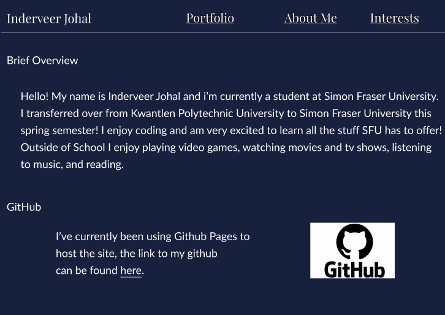
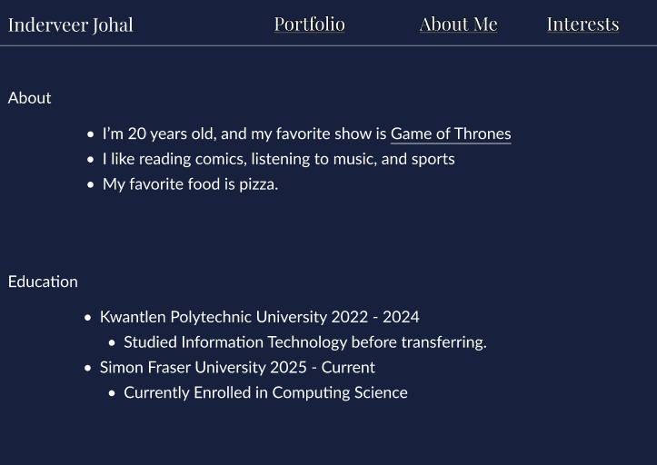
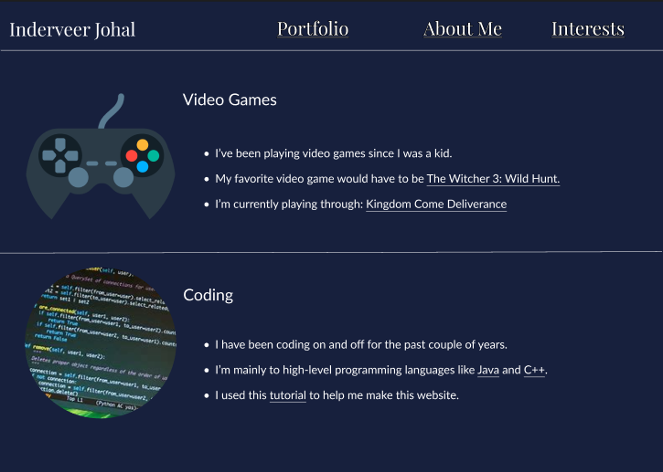
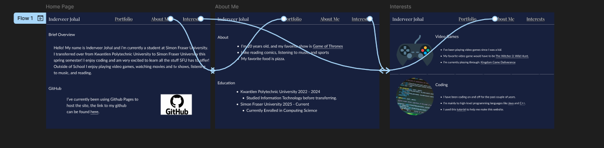

# Ind-J.github.io

# Mini-Project (45 marks)

[View Instructions Here](Mini-project.md)

[How to use Github / How to submit](https://parsa-rajabi.github.io/CMPT-276/#/assignment-lab-details?id=submission)

For this lab, you will include all of your "answers" in this README file. Make sure to cite any sources you use. 

## Task 0: Declare your AI Usage

After you completed this lab, make sure to submit the AI declaration form via MS Form and also upload a PDF copy of your responses to this repository and include the link to PDF in this README file. Note, you must submit this form regardless if you use AI or not. Failure to submit this form will be considered a violation of AI course policy. More details about the AI-usage course policy can be found [here](https://parsa-rajabi.github.io/CMPT-276/#/ai-policy).

[Link to AI Usage Disclosure MS Form](https://parsa-rajabi.github.io/CMPT-276/#/ai-policy?id=disclosure-of-ai-use)

- You will need to log in with your SFU email to access the form.

Name the file in the following format: 

`Mini_Project_AI_Declaration_FirstName_LastName_StudentID.pdf`

Example (Mini Project):

`Mini_Project_AI_Declaration_Parsa_Rajabi_123456789.pdf`

More detailed submission instructions can be found via the [lab page](https://parsa-rajabi.github.io/CMPT-276/#/labs).

## Task 1: Website Wireframe

Include screenshots of your website wireframe here. Make sure the wireframe is clear and easy to understand/read. To compliment your wireframes, describe the layout and how the elements are organized. Screenshots that are blurry or hard to read will be penalized. 

In addition to the screenshots, you can also a link to your wireframe file (if you used an online tool to create it). Make sure the link is accessible to the teaching team (check using an incognito window). This is not a replacement for the screenshots, but an additional resource for the teaching team to understand your wireframe.

[LINK TO WIREFRAME](https://www.figma.com/design/qiNZYCjPd9zqpLDEz441nJ/Portfolio?node-id=0-1&t=jXIhRopDsbfwYfpL-1)

The website as seen is pretty straight forward. There is on all pages a section on the top to help the user to navigate the site between the different tabs. All hyperlinks are also underlined, making it easier for the user to identify them as well. There is not much responsive design so most of it is simply text for the user to read through to learn more about me as a person.

## Task 2: Follow-up Questions

For this task, please include your answers for the questions described in [Lab 4](L4.md) file below:

### Q1

[Link to Other Repo(Assigned)](https://github.com/CMPT-276-SPRING-2025/solo-mini-project-Ind-J)
[Link to Website](https://ind-j.github.io/)

### Q2

My website is simple. At the top you will see tabs to goto different pages of the site. Anything that is underlined has a hyperlink. The text on the navigation uses the Playfair Display font and the normal text and lists below it use the Lato font. 

### Q3

A favicon is a small image icon that is usually situated on the website tab. It can also appear when the site is bookmarked. A favicon helps with search engine optimization by making it seem more reputable compared to if there was no favicon. Considering that most favicons are company logos, and company logos are made to be able to attract people to their company just by the logo(like how we might figure out theres a mcdonalds down the street because we see the logo) it would make sense that having favicons would also make it easier for people to get attracted to your website and learn what the favicon is tied to.

### Q4

Github Pages takes repositories straight from github and is able to host it. It is a hosting service. One of then main differences I've seen is GitHub Pages is limited to non-protiftable websites. Not allowing online business or any service on their webpages. Github Pages also does not allow anything that may violate Githubs Terms of Service. Making it seem more for educational use.

### Q5

Github Actions is a CI/CD(continuous integration and continuous delivery) that lets you create workflows then can be triggered upon certain events.

### Q6

I decided just to use some basic HTML and CSS. I decided to just stick with the basics due to me simply just not wanting to use things like react because I'm not totally confident with those just yet. And decided to put that time into learning more about git.

## Task 3: Github Video

For this task, please include your answers for the questions described in [Lab 4](L4.md) file below:

### Q1

Pull Requests is a way to ensure a development team does not mess up their main branch. When someone creates a branch off of the main, and want to then add it into the main branch will need to create a pull request.
Pull Requests compare the branch that wants to be merged to main, to the main branch itself. This allows other developers also working on the repository to see and approve of any changes if needed.

### Q2

The green boxes and number is simply how many lines were added in this specific branch. The red boxes and numbers display how many lines were removed. Both lines specificy in different ways what changed between the main and this branch.

### Q3

#### 3a

'git merge test' would take the 'test' branch, and subsequently merge it into the 'develop'. This is due to the fact that we were on the develop branch when calling this command.

#### 3b

This means that someone in one specific branch(branch A) was working on the same specific area of code(for example a selector in css) and another person on another branch was also working on that same specific code on a different branch(lets say branch B). If one of the persons wanted to merge these two branches together, it would create this error. It means that git sees there are two different versions of the same part of code and does not know which one to implement or not, leaving it to the developers.

#### 3c

The lines above 4 belong to the develop branch, and the ones below line 4 belong to the test branch, considering that the head is on the top and test is on the bottom. It means test was not the head at the time of the merger. Which means that test was being merged into develop.